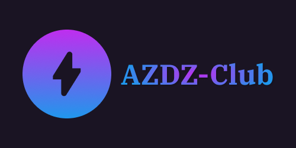

# AZDZ-101-25

    

> [TOPIC] Orientation & 4-Junction Traffic Light

The goal of this workshop is to inform new internation students about AZDZ & what it 
has to offer. Continued by a demonstration of pre-stated Workshop Topic & hopefully 
able to finish it. At last, a competition of circuits realized by the students which clears a 
given traffic instance fast. 
Workshop Details:

- Date: 31. 03. 2025
- Time: 13:00-14:15
- Venue: E006
- Contact Person: Ms. Aditi Pandey

**N.B.: Please read the activity-log for more technical details**

---

## Photos

> These photos are released under 
> [CC BY-ND 4.0](https://creativecommons.org/licenses/by-nd/4.0/)

Add taken photos here (after the workshop).

---

## Reference Schematics

1. [Single Passenger-Automobile Lane](./schema-1.pdf)

## Attended Members

> [TODO] Prospective Members

---

Made in Deggendorf with :beers: & :pretzel:
