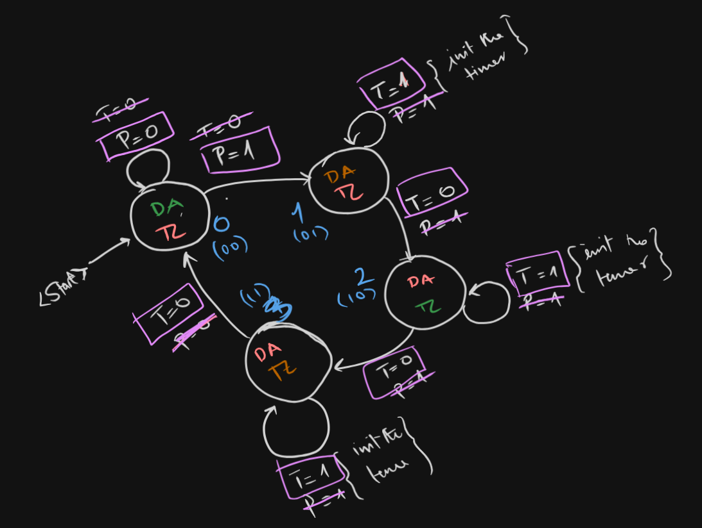
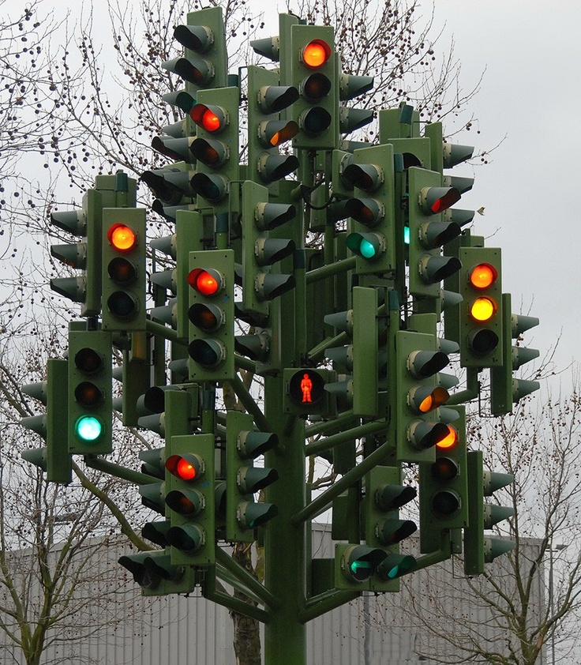
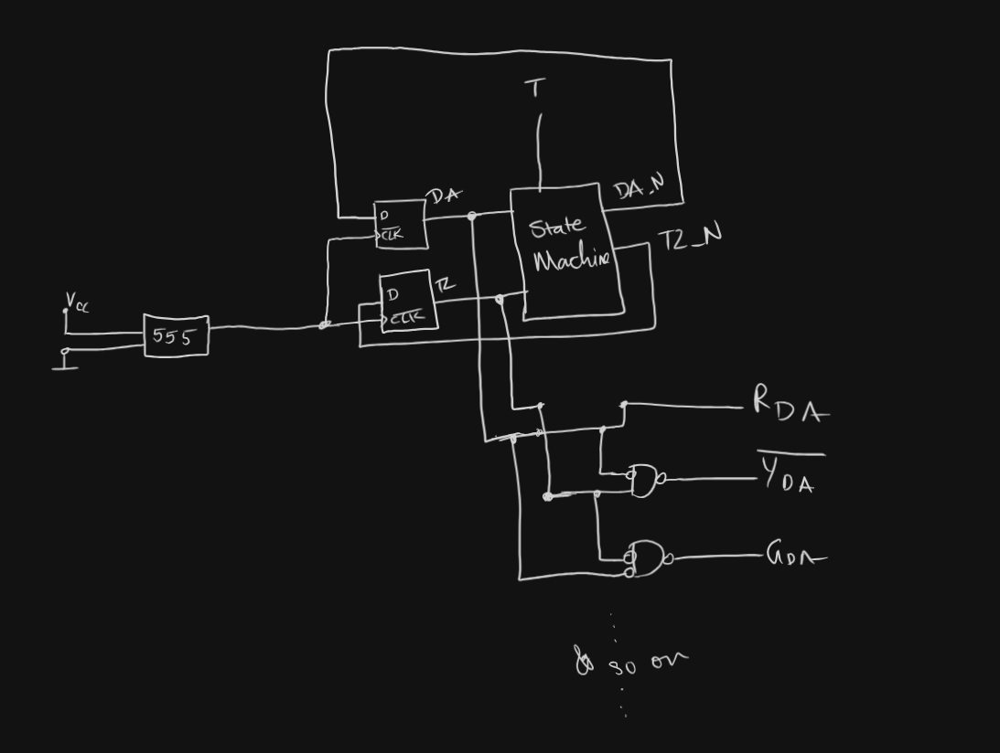
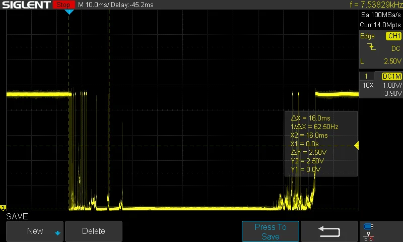
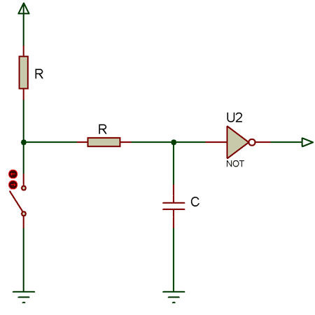

Agenda
---

0. Our goal today
1. Moore State Machine
2. Starting Point - Pedestrian Crossing
3. The bugs in this approach
4. High-Z State
5. Debouncing a component
6. What is next?

## Our Goal Today

We would like to indicate how our activity will differ from traditional
beginner tutorials found in books & YouTube videos. And what to expect from the
club activities.

<!-- end_slide -->

Moore State Machine
---

> Output is calculated from just the state iteself.

<!-- column_layout: [1, 1] -->

<!-- column: 0 -->
```cpp
State state_machine(State current_state) {
    switch (current_state) {
        case DA_GO: return DA_WARN;
        // --snipped for brevity--
    }
}
```



<!-- column: 1 -->
We input current state & this function calculates what's the next state would be.


### Your course content

You will learn about this in your Digital-Design Fundamentals Course. Following
topics are relevant:

1. K-Plan
2. KKNF/KDNF
3. Universal Gates
4. Flip-Flops

In the above picture, there are just 4 states. But this can get really messy.

One such example is as follows...

<!-- reset_layout -->

<!-- end_slide -->

State Machines - cont.
---

<!-- column_layout: [1, 2] -->

<!-- column: 0 -->
...imagine you had to do somewhat complex as this is!


<!-- column: 1 -->

### Benefits
- Easy to maintain complex systems
- Output can be optimized very easily
- Simulation is easy
- Bug fixes are relatively apparent

Then we can just create a circuit with NAND-Package chips.



<!-- reset_layout -->

<!-- end_slide -->
State Machines - cont.
---

> Full circuit without using any microcontroller can be realized. This will be
> helpful for you to transition into FPGA, ASIC designs and so on.
> 
> This is how production environment looks like, Arduino & ESP32-DevKit as just
> prototype phase tools.


This is cheaper to manufacture as well.

<!-- end_slide -->

Hand-On: Pedestrian Crossing
---

Now **Noorullah** will walk you through a small practice. After you are done,
we will see some quirks & bugs that we need to fix.

In repo, the sample code is in *pedestrian-procedural.cpp.bak* 

> Rename the file to main.cpp & delete the preexisting one

```cpp
void TrafficLightSys() {
    if (pedestrianWaiting) {
        // --snipped for brevitty
    }

    // --snipped for brevitty
}

void loop() {
    if (digitalRead(button1) == LOW) {
        if (millis() - lastPressTime > 300) {  
            // --snipped for brevitty
        }
    }

    TrafficLightSys();
}
```
<!-- end_slide -->
Bugs in our system
---

We essentailly have 2 problems.

- Code is sequential. So a button press is only registered when polled for.
- Debouncing: Why we need that `millis() < //... ` check? 

E.g. When a switch is pressed it looks like this...


<!-- end_slide -->
The Solution in Upcoming Workshops
---

In upcoming workshop first we will fix the Switch-Polling Isuue with **ISR**

> Find more here: https://wolles-elektronikkiste.de/interrupts-teil-1-externe-interrupts

Then we will look into debouncing circuits using capacitors & other active components.
For an example, following is a  very simple debouncing circuit using
just a capacitor.



<!-- end_slide -->

This Semester Plan
---

- ISR
- Debouncing a contact component
- Flip-Flop & Nand Package Circuit ohne Mikrocontroller
- Workshops from another conductor: Hr. Rishab, Graduate Student
- AI Workshop by Hrrn. Andreas Federl
- *if possible* PCB Designing 101 as well

Till then, have a nice one.
